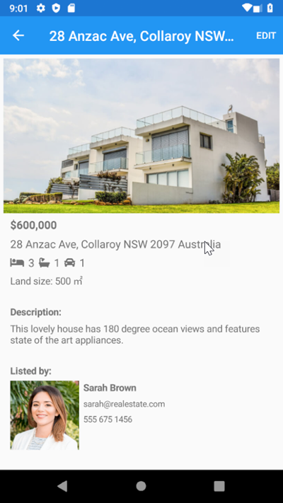
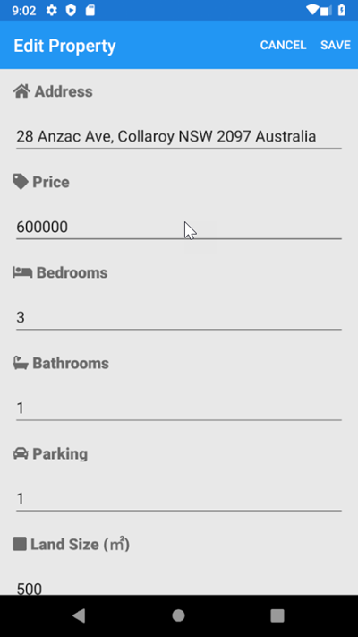
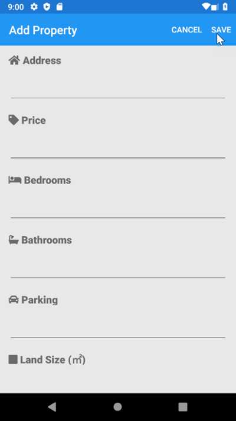
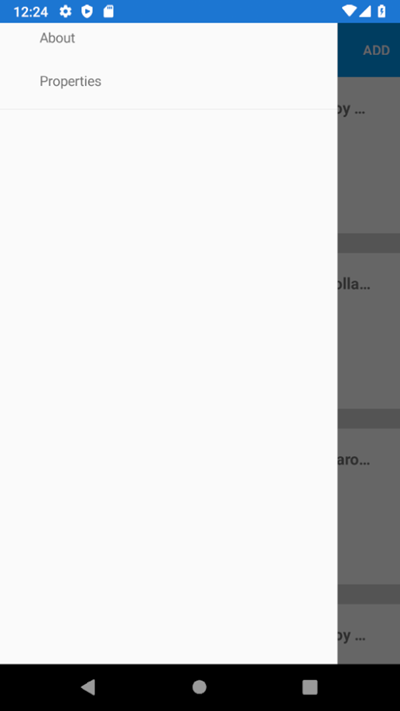

# Opgave 1.3 - RealEstateApp projektet, med UI men metoderne er tomme
Denne opgave går ud på at lave en ejendomsmægler app kaldet RealEstateApp. Den laves i Xamarin.Forms og har to formål: Træning i grundlæggende app-programmering samt at have et projekt, hvor det giver god mening at indbygge forskellige sensorer.  App'en har følgende skærmbilleder:

|  PropertyListPage |  PropertyDetailPage |  AddEditPage (EDIT) |  
|---|---|---|
|---|---|---|
|  AddEditPage (ADD) |  MenuPage |  AboutPage |  
|   |   |   |  
|   |   |   | 

I denne branch, som hedder 1.3.UInoCodeBehind, er al XAML-kode på plads og diverse eventhandlers og metoder er oprettet - men er uden indhold.

Hvis du ikke allerede har gjort det, så begynd med at hente de forrige to branches ned fra GitHub og gennemgå dem grundigt. Vær sikker på at du forstår alt inden du bygger videre på dem.

### PropertyListPage
PropertyListPage er allerede oprettet. PropertyListPage.xaml.cs indeholder en property kaldet PropertiesCollection, som indeholder objekter af typen PropertyListItem og som der kan bindes til når alle husene skal vises. Constructoren får fat i et objekt af MockRepository ved at lave  Resolve af IRepository. Derefter hentes alle Property-objekterne vha. GetProperties() og BindingContext kan sætte op. Start med at få det til at lykkedes, inden du går videre med xaml-koden.

### PropertyDetailPage

 Dens constructor skal kunne tage imod et Property objekt, som der bliver valgt i PropertyListPage. Få parameteroverførelsen til at virke, inden du går videre.

Når du har Property objektet, kan du også hente det aktuelle AgentId ved at slå op i Repository. Nu bør du have to properties, Property og Agent, som du kan binde til View'et.

### AddEditPropertyPage
Denne page kan man komme til både fra Add | PropertyListPage og fra Edit | PropertyDetailPage. Kommer vi fra Edit, skal der kunne tages imod et Property objekt i constructoren. Om der er en parameter med eller ej kan benyttes til at styre Title, som enten skal være "Add Property" eller "Edit Property".

Man kan også lave Save-eventhandleren og i første omgang få navigationen til at gå tilbage til rod-siden.

Nu kan View'et laves med binding til Property og Agent.

Hvis du har overskud til det, bør der laves noget validering af brugerinput.
